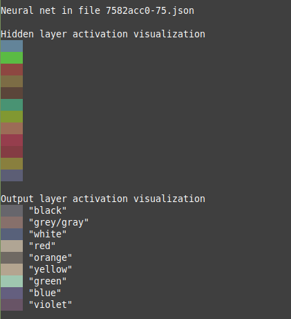

This interpretability project consists of:
- Training tiny neural networks (only one hidden layer of size 12) to classify RGB values into 9 categories (black, grey/gray, white, red, orange, yellow, green, blue, and violet).
- Interpretability work on the trained model weights.
  - First results ready


This is a sample of the activations visible on the terminal by running ```visualizer.py```:



This is one of the best models found. the learning of some colors, for instance white, was compromised by the sparsity of training examples.

Dataset adapted from https://www.kaggle.com/datasets/avi1023/color-names
